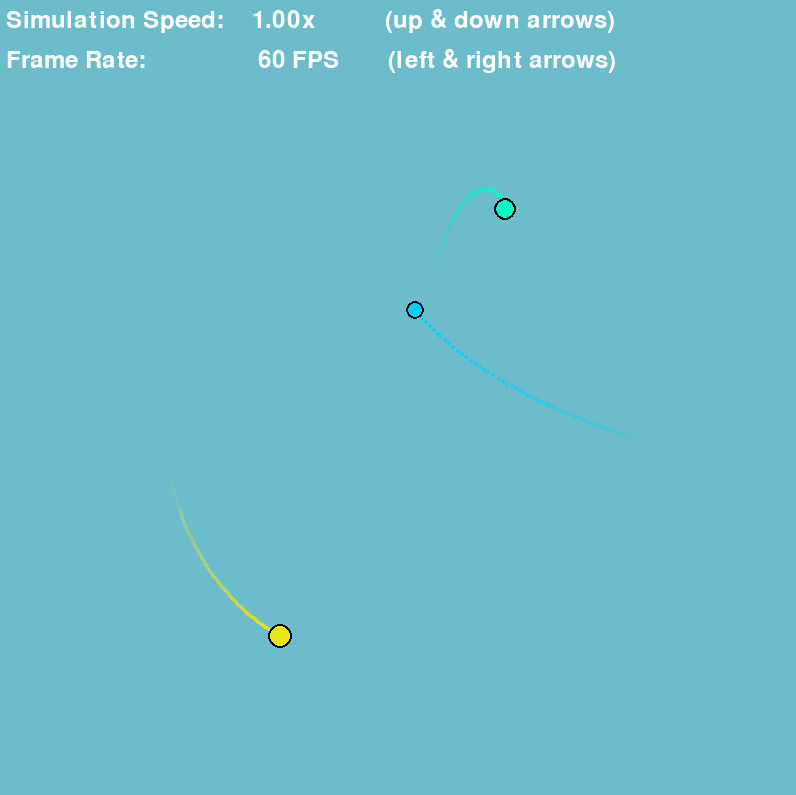

Run `main.py` to view a stable 3 body orbit

Run `space_search.py` to generate a new stable configuration in a couple of minutes
to view the new stable configuration, copy the final best parameters to the end of the
`stable_configurations` variable in `main.py`